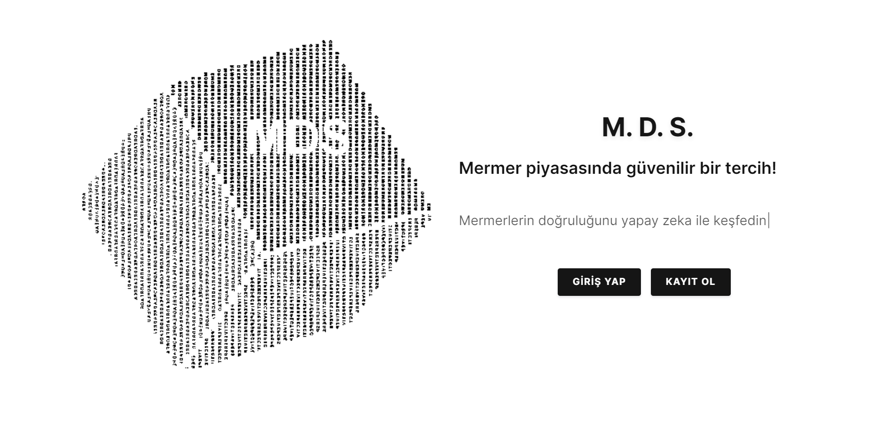

[![Contributors][contributors-shield]][contributors-url]
[![Forks][forks-shield]][forks-url]
[![Stargazers][stars-shield]][stars-url]
[![Issues][issues-shield]][issues-url]
[![MIT License][license-shield]][license-url]
[![LinkedIn][linkedin-shield]][linkedin-url]

<!-- LOGO -->
 

  

  <h3 align="center">Mermer Doğrulama Sistemi</h3>

  

    Mermer Doğrulama Sistemi 
     
    <a href="http://mds23.pythonanywhere.com/"><strong>Uygulamamızı Deneyin »</strong></a>
     

  

<!-- İÇİNDEKİLER -->

  
İçindekiler

  <ol>
    <li>
      <a href="#Proje-Hakkında">Proje Hakkında</a>
      <ul>
        <li><a href="#Kullanılan-Teknolijiler">Kullanılan Teknolojiler</a></li>
      </ul>
    </li>
    <li>
      <a href="#Projenin-Geliştirilme-Aşaması">Projenin Geliştirilme Aşaması</a>
      <ul>
        <li><a href="#Sprint-1">Sprint-1</a></li>
        <li><a href="#Sprint-2">Sprint-2</a></li>
        <li><a href="#Sprint-3">Sprint-3</a></li>
        <li><a href="#Sprint-4">Sprint-4</a></li>
      </ul>
    </li>
    <li><a href="#Projenin-Kullanımı">Projenin Kullanımı</a></li>
    <li><a href="#SWOT-Analizi">SWOT Analizi</a></li>
    <li><a href="#İletişim">İletişim</a></li>
    <li><a href="#Beyan">Beyan</a></li>
  </ol>

<!-- Proje Hakkında -->
## Proje Hakkında

[![Product Name Screen Shot][product-screenshot]](http://mds23.pythonanywhere.com/)

Bu projenin amacı, mermerlerin kalitesini tespit etmek için bir sistem geliştirmektir. Sistem, mermer resimlerini analiz etmek ve boyut, şekil ve yüzey kusurları gibi çeşitli faktörlere dayalı olarak kalitelerini belirlemek için görüntü işleme tekniklerini kullanacaktır. Sistemin çıktısı, mermerin genel kalitesini gösteren bir puanın yanı sıra dikkate alınan belirli faktörleri özetleyen ayrıntılı bir rapor olacaktır. Bu proje, üretim ortamlarında mermer kalite kontrolünün verimliliğini ve doğruluğunu artırmak ve mermer kalitesini değerlendirmek için daha tutarlı ve objektif bir yöntem sağlamak amacıyla geliştirilmektedir. Proje ekibi, görüntü işleme ve proje geliştirme konusunda uzman 7 üyeden oluşmaktadır 

(<a href="#readme-top">Başa Dön</a>)

## Kullanılan Teknolojiler

This section should list any major frameworks/libraries used to bootstrap your project. Leave any add-ons/plugins for the acknowledgements section. Here are a few examples.

* [![Next][Next.js]][Next-url]
* [![React][React.js]][React-url]
* [![Vue][Vue.js]][Vue-url]
* [![Angular][Angular.io]][Angular-url]
* [![Svelte][Svelte.dev]][Svelte-url]
* [![Laravel][Laravel.com]][Laravel-url]
* [![Bootstrap][Bootstrap.com]][Bootstrap-url]
* [![JQuery][JQuery.com]][JQuery-url]

(<a href="#readme-top">Başa Dön</a>)

<!-- Projenin Geliştirilme Aşaması -->
## Projenin Geliştirilme Aşaması

- http://mds23.pythonanywhere.com/
- Her Sprint 3 haftadan oluşur
- Her tablo bir sprint'i ifade eder.

| Okul Numarası | Adı Soyadı  | Yetkinlik |
| :-----:  | :-----: | :---: | 
|  | Osman Karadeniz | Full Stack Developer - Scrum Master|
|  | Gönenç Değirmencioğlu | Network Engineer|
| 200541083 | Ali Kadir Bulut | QA Engineer |
|  | Ercan Satık   | Database Developer | 
#
## Sprint 1

| Atama | Görev Tanımı  | Görev Süresi |
| :-----: | :---: | :---: |
| Osman Karadeniz   | potansiyel Front-end frameworkleri araştırmak ve değerlendirmek| 3 hafta |
| Gönenç Değirmencioğlu | potansiyel Back-end teknolojilerini araştırmak ve değerlendirmek  | 3 hafta |
| Ali Kadir Bulut | - | - |
| Ercan Satık | Veri setlerinin toplanması | 3 hafta |

### Sprint 1 Sonuçları
- Hedef: Proje için potansiyel Front-end frameworkleri ve Back-end teknolojilerini araştırmak ve değerlendirmek.
- Görevlendirildi: Osman Karadeniz, Gönenç Değirmencioğlu, Ercan Satık, Ali Kadir Bulut
- Çıktılar: Front-end ve Back-end teknolojilerinin karşılaştırma raporu.
- Sonuç: Karşılaştırma raporuna dayanarak hangi front-end ve back-end teknolojileri kullanılacağına karar veridi

## Sprint 2

| Atama | Görev Tanımı  | Görev Süresi |
| :-----: | :---: | :---: |
| Osman Karadeniz   | Mermer Kalite Analizi İçin İhtiyaç Duyulan Algoritmanın Geliştirilmesi| 3 hafta  |
| Gönenç Değirmencioğlu | Proje İçin Gerekli Olan Logo Tasarımı| 3 hafta  |
| Ali Kadir Bulut | Veri Setinin Ayrıştırılması ve Etiketlenmesi | 1 hafta |
| Ercan Satık | Geliştirilen Algoritmanın Testi | 2 hafta  |

### Sprint 2 Sonuçları
- Hedef: Mermerin kalitesinin analiz edilebilmesi için eğitim , test ve doğrulama şeklinde ayrılan veri seti için Derin Öğrenme algoritması (CNN) kullanılarak geliştirilmesi.
- Görevlendirildi: Osman Karadeniz, Gönenç Değirmencioğlu, Ercan Satık, Ali Kadir Bulut
- Çıktılar: Modelin Başarıyla Eğitilmesi ve projenin logosunun belirlenmesi.

## Sprint 3

| Atama | Görev Tanımı  | Görev Süresi |
| :-----: | :---: | :---: |
| Osman Karadeniz   | Geliştirilmiş Olunan Mermer Analiz Algoritması İçin Front-end tarafının Geliştirilmesi| 3 hafta |
| Gönenç Değirmencioğlu | THS Seviyelerinin Dökümantasyonu | 3 hafta |
| Ali Kadir Bulut | Lokal Ortamdaki Ürünün Testi  | 3 hafta |
| Ercan Satık | Veritabanının Lokal Ortama Bağlanması | 3 hafta |

### Sprint 3 Sonuçları 
- Hedef: Geliştirilmiş mermer analiz algoritmasının front-end tarafının geliştirilmesi, THS seviyelerinin dökümantasyonu, canlı ortamdaki ürünün testi ve veritabanının canlı ortama bağlanması.
- Görevlendirildi: Osman Karadeniz, Gönenç Değirmencioğlu, Ali Kadir Bulut, Ercan Satık
- Çıktılar: Front-end tarafının geliştirilmesi, THS seviyelerinin dökümantasyonu, canlı ortamdaki ürünün testi ve veritabanının canlı ortama bağlanması.
## Sprint 4

| Atama | Görev Tanımı  | Görev Süresi |
| :-----: | :---: | :---: |
| Osman Karadeniz   | Projenin Tam Entegrasyonu Ve Canlı Ortama Aktarılması| 3 Hafta |
| Gönenç Değirmencioğlu | Proje İçin SWOT Analizinin Yapılması | 3 Hafta |
| Ali Kadir Bulut | Canlı Ortamdaki Projenin Fonksiyonel Testlerinin Yapılması | 2 hafta  |
| Ercan Satık | Canlı Ortamdaki Projenin Fonksiyonel Olmayan Testlerin Yapılması | 2 hafta |

### Sprint 4 Sonuçları  
- Hedef: Projenin tam entegrasyonu ve canlı ortama aktarma, SWOT analizi yapılması, canlı ortamdaki projenin fonksiyonel ve fonksiyonel olmayan testlerinin yapılması.
- Görevlendirildi: Osman Karadeniz, Gönenç Değirmencioğlu, Ali Kadir Bulut, Ercan Satık
- Çıktılar: Projenin tam entegrasyonu ve canlı ortama aktarma, SWOT analizi yapılması, canlı ortamdaki projenin fonksiyonel ve fonksiyonel olmayan testlerinin yapılması.

## Projenin Kullanımı
Mermer kalite tespit sistemini kullanmak için aşağıdaki adımları izleyin:

1. Web sitemizi ziyaret edin: [http://mds23.pythonanywhere.com/]
2. Cihazınızdan bir mermer görüntüsü seçmek için 'Dosya Seç' düğmesine tıklayın.
3. Görüntüyü yüklemek ve kalite analiz sürecini başlatmak için 'Gönder' düğmesine tıklayın.
4. Sistem görüntüyü işleyecek ve ortaya çıkan kalite puanını ve raporu web sayfasında gösterecektir.
5. Başka misketleri analiz etmek için 2-4 arası adımları tekrarlayın.
Sistemin tek tek mermerlerin yüksek kaliteli görüntüleri için optimize edildiğini lütfen unutmayın. En iyi sonuçları elde etmek için, bilyenin iyi aydınlatılmış ve odakta olduğundan ve görüntünün başka nesneler veya arka planlar içermediğinden emin olun. Sistem, kısmen örtülü olan veya karmaşık desenlere veya yüzey dokularına sahip olan mermerleri doğru bir şekilde analiz edemeyebilir.

(<a href="#readme-top">Başa Dön</a>)

<!-- SWOT Analizi -->
## SWOT Analizi

[![Product Name Screen Shot][swot-screenshot]](http://mds23.pythonanywhere.com/)

(<a href="#readme-top">Başa Dön</a>)

<!-- İletişim -->
## İletişim

Osman Karadeniz - [@osmankaradeniz](https://www.linkedin.com/in/osmankaradeniz/) 

Proje Linki: [http://mds23.pythonanywhere.com/](http://mds23.pythonanywhere.com/)

(<a href="#readme-top">Başa Dön</a>)

## Beyan

Fırat Üniversitesi Yazılım Mühendisliği Bölümü kurallarına uygun olarak hazırladığım “Yazılım Mühendisliği Güncel Konular - Mermer Doğrulama Sistemi" Başlıklı proje dokümanımın içindeki bütün bilgilerin doğru olduğunu, bilgilerin üretilmesi ve sunulmasında bilimsel etik kurallarına uygun davrandığımı, kullandığım bütün kaynakları atıf yaparak belirttiğimi, maddi ve manevi desteği olan tüm kurum/kuruluş ve kişileri belirttiğimi, burada sunduğum veri ve bilgileri unvan almak amacıyla daha önce hiçbir şekilde kullanmadığımı beyan ederim.

(<a href="#readme-top">Başa Dön</a>)

<!-- lİNKLER -->
<!-- https://www.markdownguide.org/basic-syntax/#reference-style-links -->
[contributors-shield]: https://img.shields.io/github/contributors/othneildrew/Best-README-Template.svg?style=for-the-badge
[contributors-url]: https://github.com/alikadirbulut/InventoryManager
[forks-shield]: https://img.shields.io/github/forks/othneildrew/Best-README-Template.svg?style=for-the-badge
[forks-url]: https://github.com/alikadirbulut/InventoryManager
[stars-shield]: https://img.shields.io/github/stars/othneildrew/Best-README-Template.svg?style=for-the-badge
[stars-url]: https://github.com/alikadirbulut/InventoryManager
[issues-shield]: https://img.shields.io/github/issues/othneildrew/Best-README-Template.svg?style=for-the-badge
[issues-url]: https://github.com/alikadirbulut/InventoryManager
[license-shield]: https://img.shields.io/github/license/othneildrew/Best-README-Template.svg?style=for-the-badge
[license-url]: https://github.com/alikadirbulut/InventoryManager
[linkedin-shield]: https://img.shields.io/badge/-LinkedIn-black.svg?style=for-the-badge&logo=linkedin&colorB=555
[linkedin-url]: https://www.linkedin.com/in/osmankaradeniz/
[product-screenshot]: images/screenshot.png
[Next.js]: https://img.shields.io/badge/next.js-000000?style=for-the-badge&logo=nextdotjs&logoColor=white
[Next-url]: https://nextjs.org/
[React.js]: https://img.shields.io/badge/React-20232A?style=for-the-badge&logo=react&logoColor=61DAFB
[React-url]: https://reactjs.org/
[Vue.js]: https://img.shields.io/badge/Vue.js-35495E?style=for-the-badge&logo=vuedotjs&logoColor=4FC08D
[Vue-url]: https://vuejs.org/
[Angular.io]: https://img.shields.io/badge/Angular-DD0031?style=for-the-badge&logo=angular&logoColor=white
[Angular-url]: https://angular.io/
[Svelte.dev]: https://img.shields.io/badge/Svelte-4A4A55?style=for-the-badge&logo=svelte&logoColor=FF3E00
[Svelte-url]: https://svelte.dev/
[Laravel.com]: https://img.shields.io/badge/Laravel-FF2D20?style=for-the-badge&logo=laravel&logoColor=white
[Laravel-url]: https://laravel.com
[Bootstrap.com]: https://img.shields.io/badge/Bootstrap-563D7C?style=for-the-badge&logo=bootstrap&logoColor=white
[Bootstrap-url]: https://getbootstrap.com
[JQuery.com]: https://img.shields.io/badge/jQuery-0769AD?style=for-the-badge&logo=jquery&logoColor=white
[JQuery-url]: https://jquery.com 
[swot-screenshot]: images/SWOT.png
